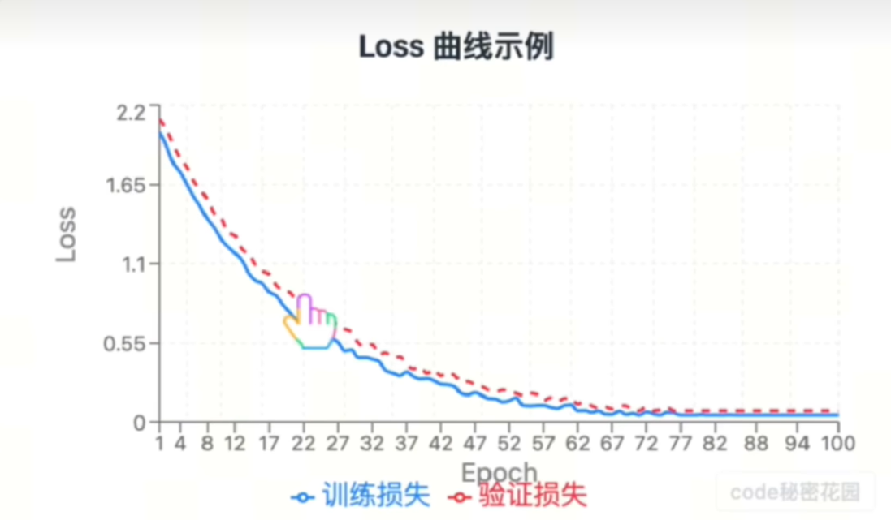
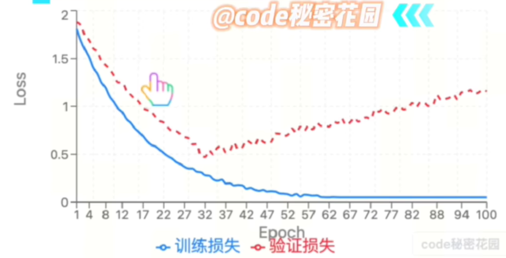
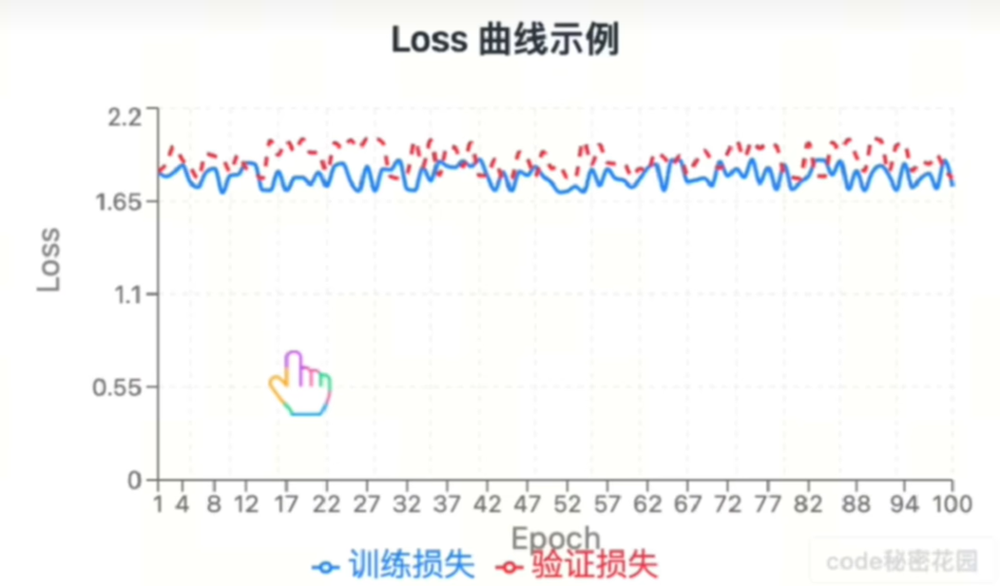

# 过拟合与欠拟合

两者接近,最后有一个平台期,收敛了

过拟合(高方差):训练集误差很低,验证集误差明显更高,两者差距大。模型"死记硬背"了训练数据。

欠拟合(高偏差):训练集误差高,验证集误差也高,两者接近。模型连训练数据都没学好。

以下train为测试集,val为验证集

## 排查过拟合与欠拟合
先排除代码的bug,再谈拟合

### 过拟合小批量
步骤
1. 取一个固定的极小 batch（几张图、几十条文本）；
2. 关掉所有随机性：dropout 关闭、数据增强关闭、shuffle 关闭；
3. 在这一个 batch 上反复训练几百上千步。
- 如果loss接近0,准确率100%,代码逻辑基本没问题,排除数据;
- 如果loss降不下去,排查:
1. 标签错位,shuffle的特征与标签未同步打乱
2. loss/指标错误
3. 忘记optimizer.zero_grad(),梯度累计污染了下降方向
4. loss对最终输出不可微,出现了断裂
5. 初始化或是激活问题
6. 学习率问题:极端大或极端小

### 数据层排查
#### 数据质量问题(欠拟合多)
- 标签噪声:标签错误率较高,模型会学习噪声
- 类别不平衡:对于某些类准确率低,`改用混淆矩阵,每类召回率来判断`
- 数据质量本身不足

#### 预处理的一致性问题(过拟合多)
- 训练/验证预处理不一致
- 泄露消失:特征里有未来信息,训练集和测试集随机划分时未分清

#### 划分与分布验证
- 训练/验证的分布偏移:分别统计两边的标签分布、特征分布（可画直方图或用简单分类器做 AUC 测试
- 划分方式错误:时序数据随机划分（应用按时间切）、同一用户的样本同时出现在 train 和 val（医学影像同一病人的多张片子、推荐系统同一用户行为）——这会造成假性泛化好

### 模型容量排查
#### 欠拟合排查
- 基线对比:使用一大一小两个模型训练进行对比
- 结构消融:逐步加深/加宽网络,观察训练loss是否随之下降:
  - 加容量后 train loss 明显下降 → 之前确实是容量不足；
  - 加容量后 train loss 纹丝不动 → 不是容量问题，回到数据/优化层排查。
- 特征的能力不足:特征携带的信息不够.
> 检验:让人来看特征能否推理出结果
#### 过拟合排查
- 容量递减实现:容量递减实验：逐步缩小模型，如果 val 表现反而变好，确认过拟合；
- 数据量-性能曲线：val 误差随数据增加持续下降 → 高方差，数据侧手段有效；高位收敛 → 高偏差。

### 训练过程排查
#### 学习率
画学习率和loss的曲线
- loss 长期线性缓慢下降 → LR 太小（欠拟合假象：其实是"没训完"）；
- loss 剧烈震荡/NaN → LR 太大；

#### 看训练是否充分
- loss还在下降就停了,欠拟合
- 注意loss的量级:有时看着平台了,实际还在下降,加个log试试

#### 看正则
- 欠拟合:dropout太大?weight decay太强?数据增强太狠?
- 过拟合时:逐项加入正则并观察gap的收窄速度,可以量化每种手段的贡献

#### 框架行为陷阱
- model.eval忘记关闭了
- BN 的 running statistics 在小 batch 下估计不准 → train 好 val 差。验证：临时把 BN 换成 GroupNorm 对比，或增大 batch；
- 指标计算在 torch.no_grad() 之外的累积错误、跨 epoch 没重置累计器等工程 bug。

#### 随机性控制
排查时固定所有 seed（数据、初始化、cuDNN）。防止随机导致的结果不一致

## 应对方案
### 欠拟合
1. 增加模型复杂度
2. 特征工程
3. 减少正则化
4. 延长训练时间/调整优化
5. 检查数据本身

### 过拟合
1. 增加数据
> 包括数据增强和数据生成
2. 正则化
- L2,L1正则化
- Dropout
- BatchNorm
- early stopping
3. 降低模型复杂度
- 减少网络层数或神经元数
- 减少特征数目也可
4. 集成方法(模型串行与并行)
5. 交叉验证
6. 其他
- 标签平滑
- 噪声注入
- 迁移学习
- 多任务学习:共享表示
